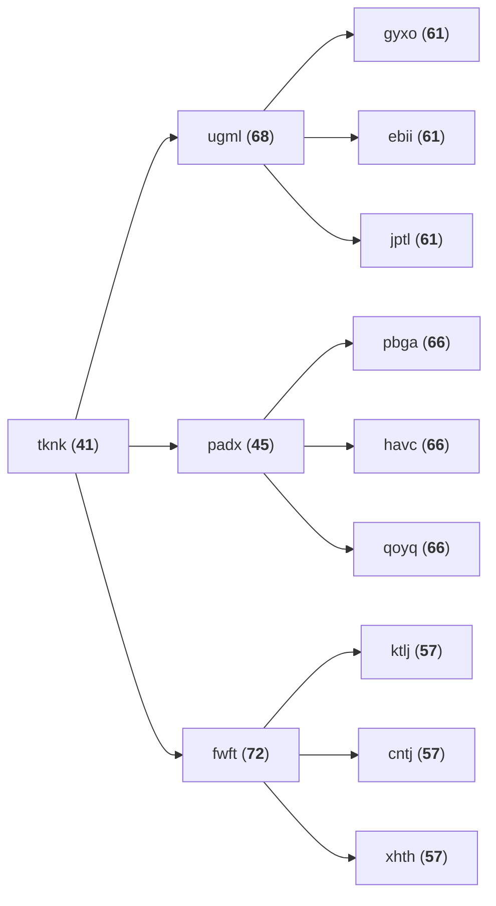

# Day 7: Recursive Circus

## Part One

Wandering further through the circuits of the computer, you come upon a tower of programs that have gotten themselves into a bit of trouble. A recursive algorithm has gotten out of hand, and now they're balanced precariously in a large tower.

One program at the bottom supports the entire tower. It's holding a large disc, and on the disc are balanced several more sub-towers. At the bottom of these sub-towers, standing on the bottom disc, are other programs, each holding their own disc, and so on. At the very tops of these sub-sub-sub-...-towers, many programs stand simply keeping the disc below them balanced but with no disc of their own.

You offer to help, but first you need to understand the structure of these towers. You ask each program to yell out their name, their weight, and (if they're holding a disc) the names of the programs immediately above them balancing on that disc. You write this information down (your puzzle input). Unfortunately, in their panic, they don't do this in an orderly fashion; by the time you're done, you're not sure which program gave which information.

For example, if your list is the following:

```txt
pbga (66)
xhth (57)
ebii (61)
havc (66)
ktlj (57)
fwft (72) -> ktlj, cntj, xhth
qoyq (66)
padx (45) -> pbga, havc, qoyq
tknk (41) -> ugml, padx, fwft
jptl (61)
ugml (68) -> gyxo, ebii, jptl
gyxo (61)
cntj (57)
```

...then you would be able to recreate the structure of the towers that looks like this:



In this example, `tknk` is at the bottom of the tower (the bottom program), and is holding up ugml, padx, and fwft. Those programs are, in turn, holding up other programs; in this example, none of those programs are holding up any other programs, and are all the tops of their own towers. (The actual tower balancing in front of you is much larger.)

Before you're ready to help them, you need to make sure your information is correct. **What is the name of the bottom program?**

### Thoughts on Part One (Rust Edition)

- My first thought was to implement our data structure as a graph -- which is, ultimately, overkill for our current requirements, but may still become relevant at some point.
- Then I considered something along the lines of a linked list thingy, but reading [Learning Rust With Entirely Too Many Linked Lists](https://rust-unofficial.github.io/too-many-lists/) caused me to rethink that approach. (Note however, this linked list tutorial looks like it will be incredibly helpful to work through in our attempt to figure out Rust!)
- I decided it was essentially a Tree, but [A Tree Structure implemented in Rust.](https://applied-math-coding.medium.com/a-tree-structure-implemented-in-rust-8344783abd75) had this to say (before fading away behind its paywall): "_Rust is known to be notorious difficult when it comes to certain data structures like linked lists, trees, etc. Many of such data structures have in common the necessity of several variables pointing to one value. For instance in a graph, two vertices could have a connection to a shared vertex. But when removing just one of these vertices, the shared vertex should not be dropped. In other words, none of these vertices can own the shared vertex in the strict sense._"
- Our tree is **NOT** a _binary tree_, but [Implementing a Binary Tree in Rust for fun](https://rusty-ferris.pages.dev/blog/binary-tree-sum-of-values/) could be useful.
- This is the point at which I started to rethink my life choices, specifically the choice to use **Rust**.
  - Rust is focussed on generating "safe" code -- but "safe" specifically means its data is not corruptible. It does not mean our code is less likely to crash.
  - So ... is it a language I really need? It seems to require jumping through way too many hoops just to achieve something that would be simple in other languages.
- Ultimately I opted to switch to [Ruby](../../doc/languages/Ruby.md) because **Part Two** just proved to be too difficult (and too _painful_) to implement in Rust. Our Rust implementation of PArt One can be found [here](./attempt-in-rust/), but we shall rewrite it in Ruby and proceed from there!
